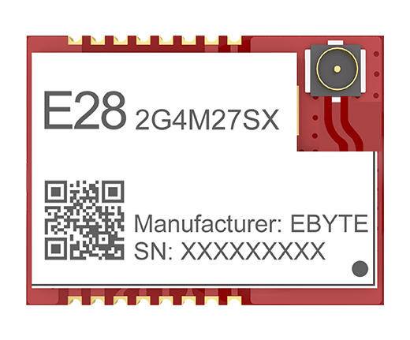
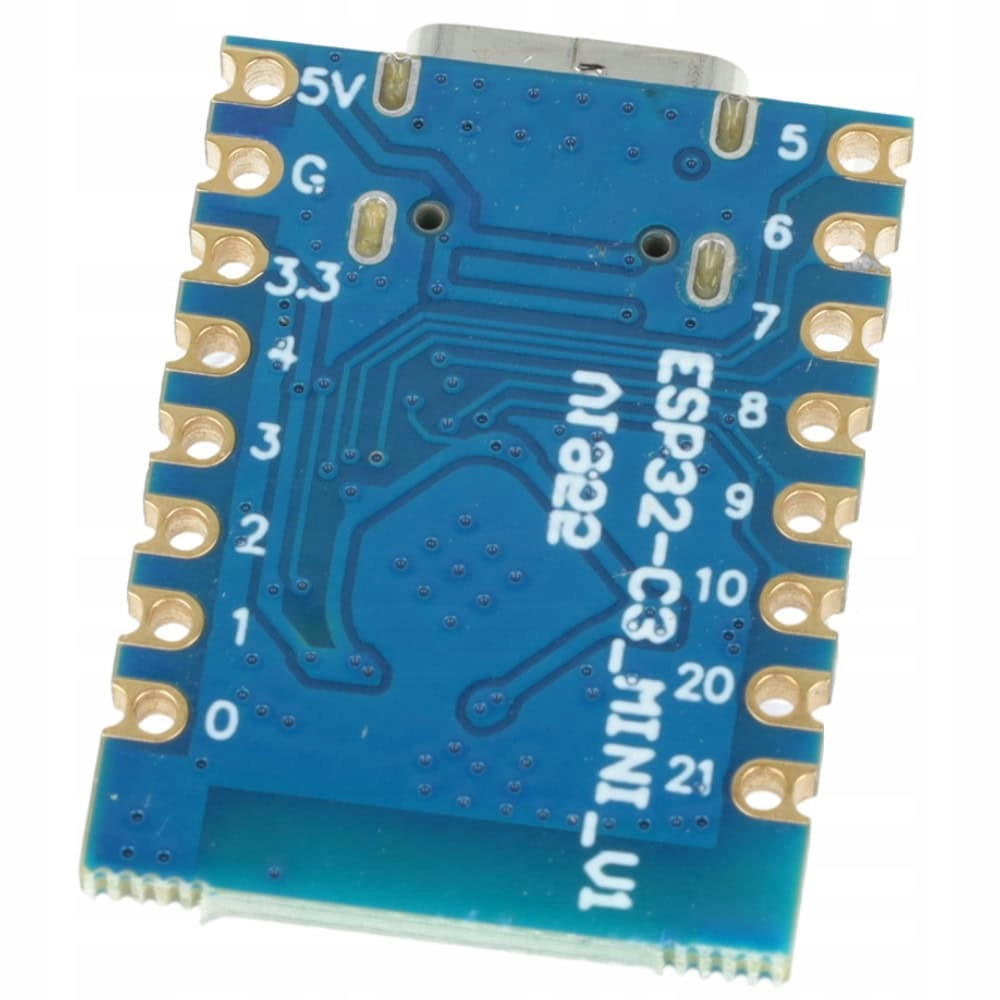

# ExpressLRS RX for E28-2G4M27SX (2.4GHz 500mW)

Custom ELRS RX firmware for E28-2G4M27SX module (SX1281, 27dBm/500mW).



## Hardware

### Receiver (RX only)
- **MCU:** ESP32-C3
- **Radio:** E28-2G4M27SX (SX1281, 27dBm/500mW)



## Frequency
- Band: ISM 2.4GHz (2400-2500MHz)

---

## Wiring Diagram

### RX: ESP32-C3 + E28-2G4M27SX

```
ESP32-C3                   E28-2G4M27SX
┌─────────────────┐        ┌─────────────────┐
│ GPIO20 (RX) ────┼────────┼─ (to FC)        │
│ GPIO21 (TX) ────┼────────┼─ (from FC)      │
│ GPIO1  ─────────┼────────┼─ DIO1           │
│ GPIO2  ─────────┼────────┼─ RST            │
│ GPIO3  ─────────┼────────┼─ BUSY           │
│ GPIO4  ─────────┼────────┼─ MOSI           │
│ GPIO5  ─────────┼────────┼─ MISO           │
│ GPIO6  ─────────┼────────┼─ SCK            │
│ GPIO7  ─────────┼────────┼─ NSS            │
│ GPIO0  ─────────┼────────┼─ TXEN           │
│ GPIO10 ─────────┼────────┼─ RXEN           │
│ GPIO8  ─────────┼────────┼─ LED            │
│ 3V3    ─────────┼────────┼─ VCC (3.3V)     │
│ GND    ─────────┼────────┼─ GND            │
└─────────────────┘        └─────────────────┘
```

| ESP32-C3 Pin | E28-2G4M27SX Pin | Function |
|--------------|------------------|----------|
| GPIO1 | DIO1 | Radio interrupt |
| GPIO2 | RST | Radio reset |
| GPIO3 | BUSY | Radio busy |
| GPIO4 | MOSI | SPI data out |
| GPIO5 | MISO | SPI data in |
| GPIO6 | SCK | SPI clock |
| GPIO7 | NSS | SPI chip select |
| GPIO0 | TXEN | PA TX enable |
| GPIO10 | RXEN | PA RX enable |
| GPIO8 | - | LED |
| GPIO20 | - | Serial RX (to FC) |
| GPIO21 | - | Serial TX (from FC) |

---

## Flashing Firmware on Virgin ESP32-C3

### Requirements
- USB-TTL adapter (CH340, CP2102, FT232)
- `pip install esptool`

### Wiring for flashing
```
USB-TTL          ESP32-C3
─────────        ────────
TX      ──────── GPIO20 (RX)
RX      ──────── GPIO21 (TX)
3V3     ──────── 3V3
GND     ──────── GND + GPIO9 (boot)
```

**Note:** GPIO9 must be LOW during power-on to enter bootloader mode.

### Flash command
```bash
esptool.py --port /dev/ttyUSB0 --baud 460800 \
    --chip esp32c3 write_flash 0x0 ELRS_*_RX_ESP32C3_E28-2G4M27SX.bin
```

### After Flashing
1. Disconnect GPIO9 from GND, power cycle
2. Connect to WiFi: `ExpressLRS RX`
3. Configure at `10.0.0.1`

---

## Download
See [Releases](https://github.com/ddlabus/ExpressLRS-E28-2G4/releases)

## Links
- [E28-2G4M27SX Datasheet](https://www.cdebyte.com/products/E28-2G4M27SX)
- [ESP32-C3 Datasheet](https://www.espressif.com/en/products/socs/esp32-c3)
- [ExpressLRS Documentation](https://www.expresslrs.org/)
